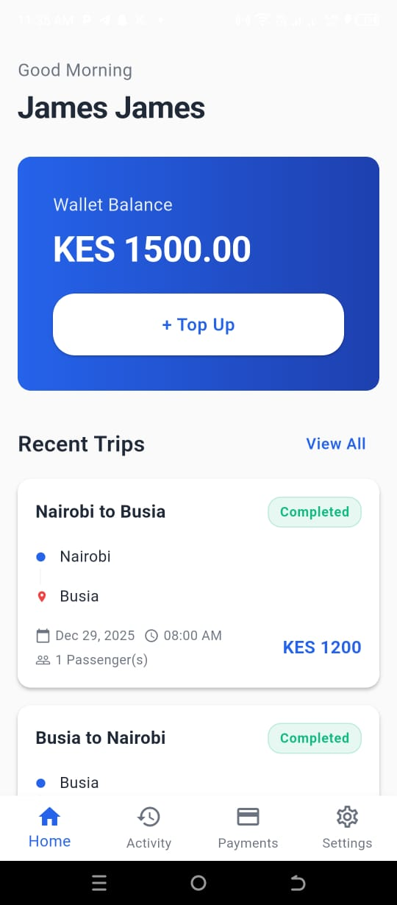
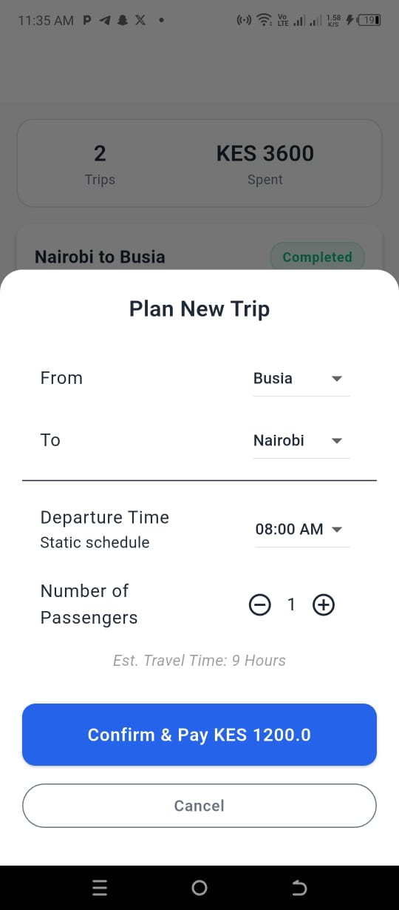
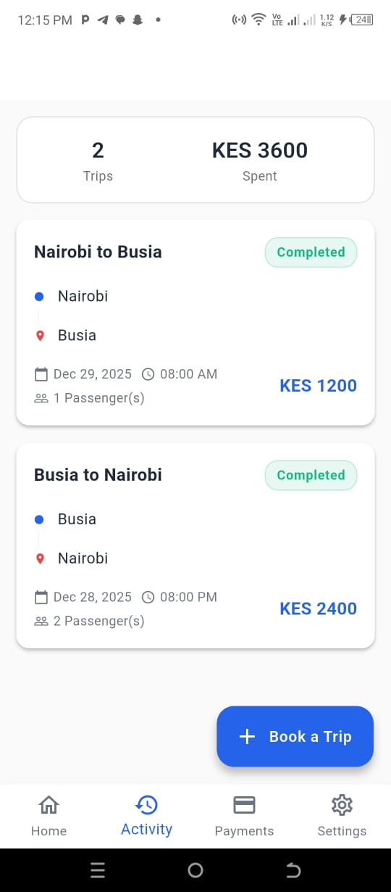

# 🚌 Komiut
> Modern transit management revolutionizing the commuter experience in African cities

Komiut is a production-ready Flutter application featuring secure authentication, real-time trip simulation, and dynamic payment systems designed specifically for the African public transport ecosystem.


<p align="center">
  
</p>

<p align="center">
  
  
  
  
</p>


## ✨ Key Features

### 🔐 Secure Authentication
- Complete onboarding flow with Sign-up to 2FA verification
- Password recovery with mocked reset link logic
- OTP verification (simulated with code: `123456`)

### 💰 Smart Wallet Management
- Real-time balance updates across all screens
- Instant reconciliation after top-ups or trip bookings
- Support for M-Pesa and Credit/Debit card payments
- Complete transaction history

### 🚍 Trip Booking & Simulation
- Book trips across major Kenyan routes (Nairobi, Busia, Kisumu, Mombasa)
- 20-second real-time trip simulation engine
- Realistic journey durations (e.g., Nairobi to Busia ~9 hours)
- 20% randomized failure scenarios to test error handling

### 🎨 Enhanced User Experience
- Dynamic greeting based on time of day
- Full dark/light theme support
- Responsive UI with smooth animations
- Comprehensive activity tracking

## 🚀 Quick Start

### Prerequisites
- Flutter SDK ≥3.0.0
- Dart SDK ≥3.0.0

### Installation

**1. Clone the repository**
```bash
git clone https://github.com/fnabatwa/komiut.git
cd komiut
```

**2. Install dependencies**
```bash
flutter pub get
```

**3. Run the app**
```bash
flutter run
```

**4. Test credentials**
- email: james@gmail.com
- password: password123
- OTP code: `123456`

## 🏗 Architecture Overview

This project implements **Feature-First Clean Architecture**, chosen for modularity, maintainability, and scalability.

### Architecture Layers

**Core Layer**  
Global configurations shared across the entire application:
- Constants (Colors, Spacing, Typography)
- Theme management (Dark/Light mode)
- Reusable atomic widgets

**Features Layer**  
Self-contained feature modules with three-layer separation:

```
feature/
├── domain/models/     # Business logic & entities
├── data/services/     # Mocked services & data sources
└── presentation/      # UI screens, providers & widgets
```

Current features:
- **Auth** - Login, signup, 2FA verification
- **Home** - Dashboard and main navigation
- **Activity** - Trip history and booking
- **Payments** - Wallet management and top-ups
- **Settings** - User profile and preferences

### State Management: Riverpod

Riverpod was chosen for its compile-time safety and ability to handle complex dependencies:

- **Reactive UI**: Global state (wallet balance, theme) updates instantly across screens
- **Single Source of Truth**: Logic is decoupled from widgets, ensuring data consistency between the Home and Activity screens
- **Async Handling**: Seamless loading and error states using `AsyncValue`

## 📂 Project Structure

```
lib/
├── main.dart
├── core/
│   ├── constants/
│   │   ├── app_colors.dart
│   │   ├── app_spacing.dart
│   │   └── app_text_styles.dart
│   ├── theme/
│   │   ├── app_theme.dart
│   │   └── theme_provider.dart
│   └── widgets/
│       ├── custom_button.dart
│       ├── custom_text_field.dart
│       ├── empty_state.dart
│       ├── loading_indicator.dart
│       ├── payment_card.dart
│       └── trip_card.dart
│
└── features/
    ├── activity/
    │   ├── data/services/
    │   ├── domain/models/
    │   └── presentation/ (providers, screens)
    ├── auth/
    │   ├── data/services/
    │   ├── domain/models/
    │   └── presentation/ (providers, screens)
    ├── home/
    │   └── presentation/screens/
    ├── payments/
    │   ├── data/services/
    │   ├── domain/models/
    │   └── presentation/ (providers, screens)
    └── settings/
        └── presentation/screens/
```

## 🎯 Design Decisions & Assumptions

The following decisions were made to bridge requirements with real-world implementation:

### Geographic Scope
- Currently scoped to **domestic travel within Kenya**
- Routes and pricing are based on standard rates for major hubs (Nairobi, Busia, Kisumu, etc.)
- Journey durations reflect realistic travel times

### Authentication & Security
- Auth state is kept in memory; a hard app restart returns users to the splash screen to simulate a fresh secure session
- **2FA Implementation**: For demonstration purposes, the OTP is hardcoded to `123456`

### Payment Ecosystem
- M-Pesa and Credit/Debit cards are implemented as the primary payment methods, reflecting the Kenyan market landscape
- Instant balance reconciliation occurs after successful top-ups

### Transit Simulation
- A 20-second simulation represents journey progression
- A 20% failure rate was added to test and demonstrate error-state UI handling (e.g., vehicle breakdown)

## 🛣 Roadmap

### Implemented ✅
- Complete authentication flow (Login to 2FA)
- Wallet management system with Top-ups
- Trip booking and status simulation
- Real-time balance synchronization
- Dark/light theme support

### Planned Features 🔮
- **Local Persistence**: Using Hive or Shared Preferences to persist sessions and trip history
- **Real API Integration**: Connecting to a live backend
- **Push Notifications**: Alerts for trip status changes
- **Live Tracking**: Route optimization using Google Maps API

## 📋 Known Limitations

- **Session Persistence**: Authentication state clears on app restart (Design Decision)
- **Mocked Backend**: All data operations are simulated locally
- **Geographic Constraint**: Limited to predefined Kenyan routes

## 📄 License

This project is licensed under the MIT License.

## 👨‍💻 Author

**Your Name**
- GitHub: [@fnabatwa](https://github.com/fnabatwa)

---


<p align="center">Made with ❤️ for African commuters</p>
